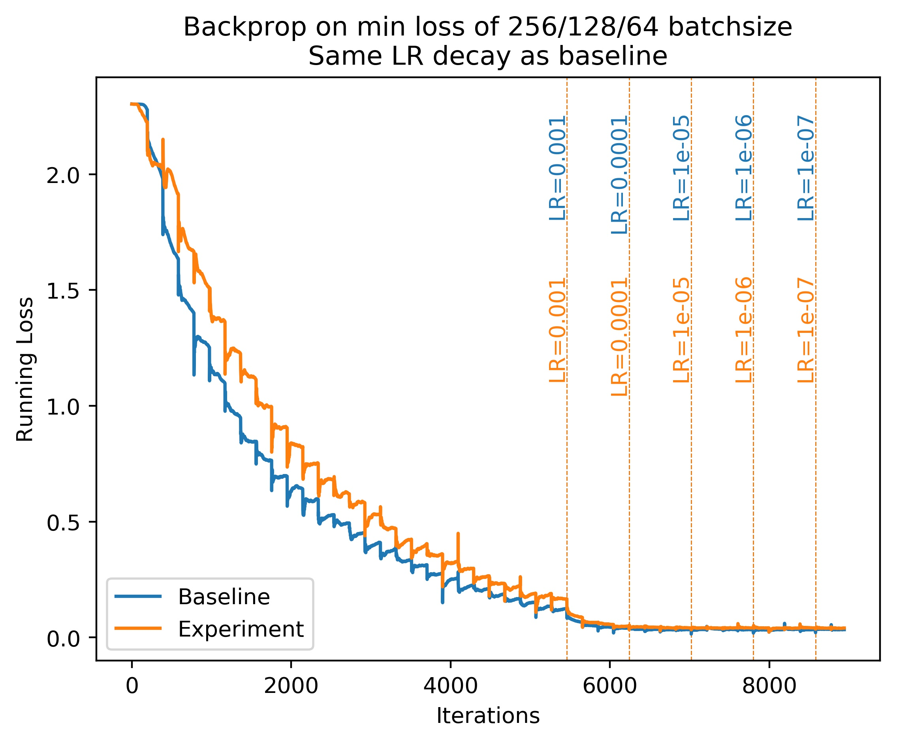
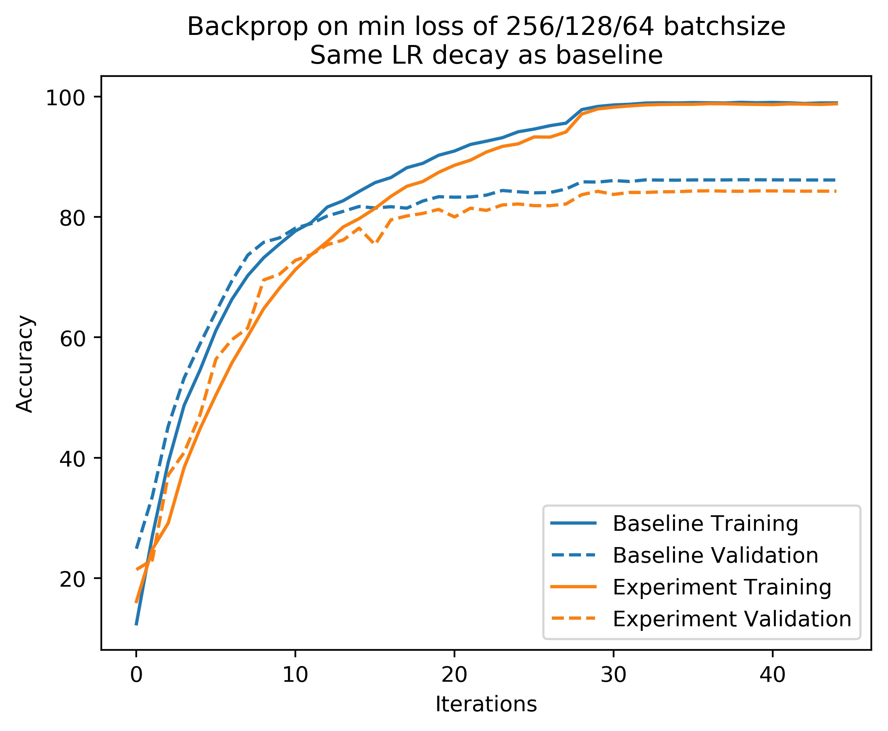
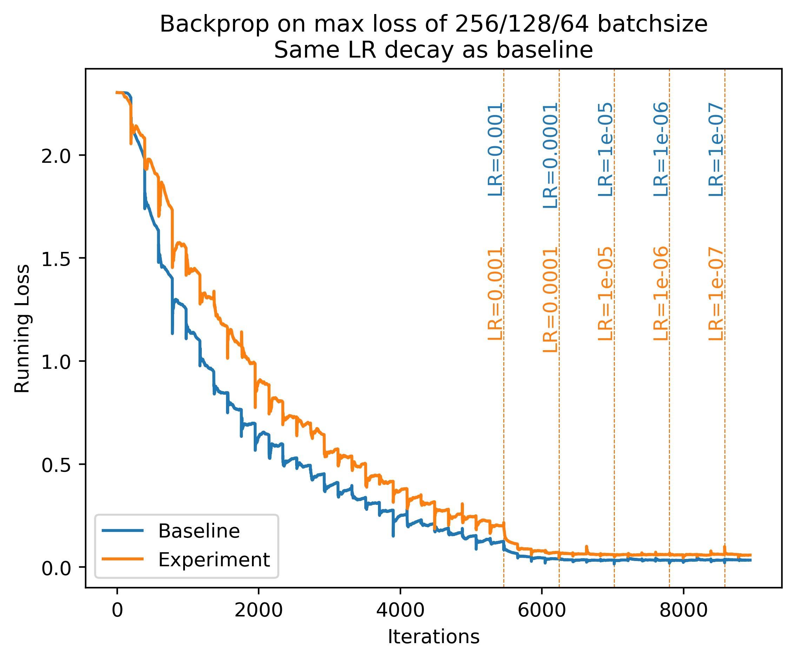
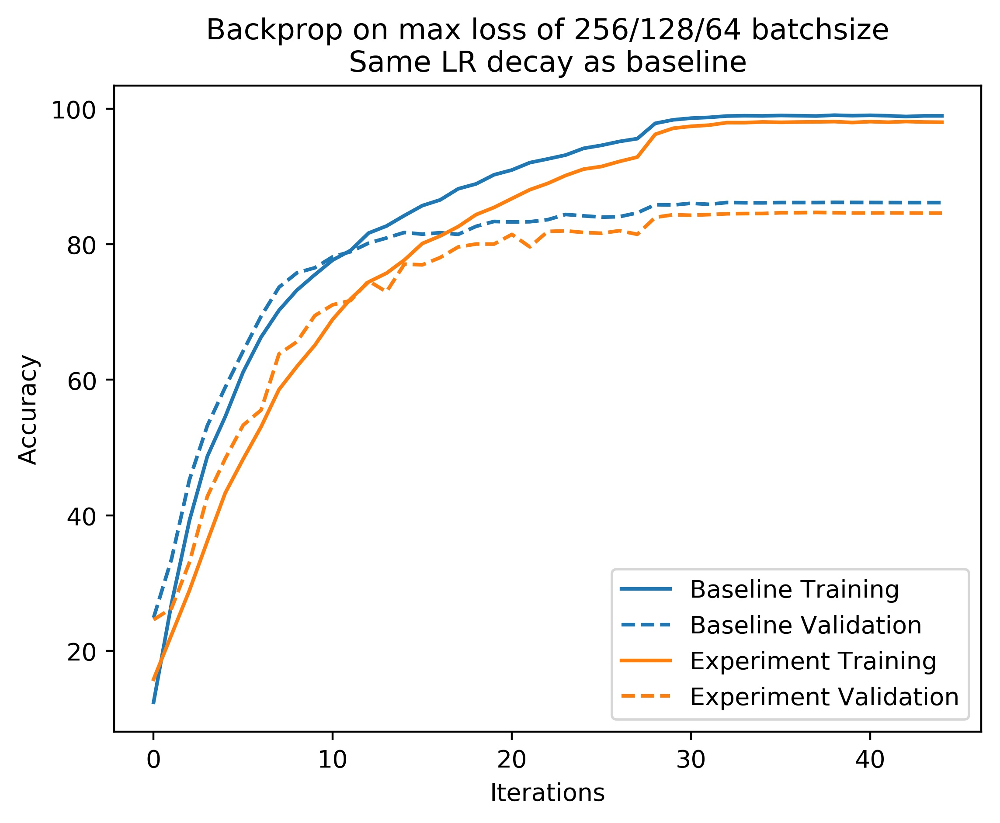

# Batch Size Variation
This repository implements my experiments with dynamic/online batch size selection during training of deep learning models.

## Implementation
The experiment is described below:
- The base batch size is set to 256, that is, the data loader always returns a batch of size 256.
- During each iteration, we run the forward pass with three different batch sizes:
  - Batch size 256:
    - Run the forward pass for the entire batch.
    - Calculate the average loss for the 256 batch items.
  - Batch size 128:
    - Split the batch of 256 items into two parts, sized 128 each.
    - Run the forward pass for each split and calculate the average loss for the 256 batch items.
  - Batch size 64:
    - Split the batch of 256 items into four parts, sized 64 each.
    - Run the forward pass for each split and calculate the average loss for the 256 batch items.
- Batch size selection criteria: The experiment was performed using two different selection criteria, minimum average loss and maximum average loss.
- Select the final batch size (for current iteration) as per selection criteria.
- Backprop and optimize (step) on the loss calculated for the selected batch size.
  - This means, for batch size 256, we backprop and optimize once; for batch size 128, we do this twice and for batch size 64, we do this four times.
  - To keep the comparison fair (since number of gradient descent steps are different), we scale the learning rate (step size) based on the selected batch size in each iteration.
    - For batch size 256, no scaling is done.
    - For batch size 128, learning rate is halved.
    - For batch size 64, learning rate is scaled to 1/4th.

## Results
Below are the accuracy and loss curves for the experiment.

## Inference
As evident from the plots above, online selection of batch size performs poorly as compared to using fixed batch size during training. This is true for both maximum loss and minimum loss selection criteria.
